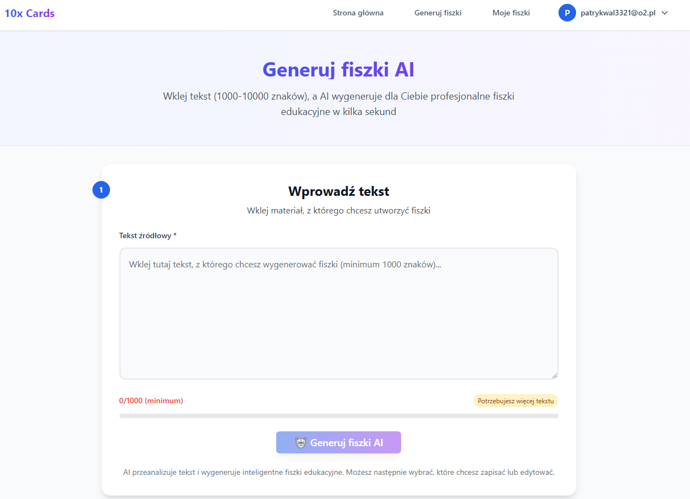
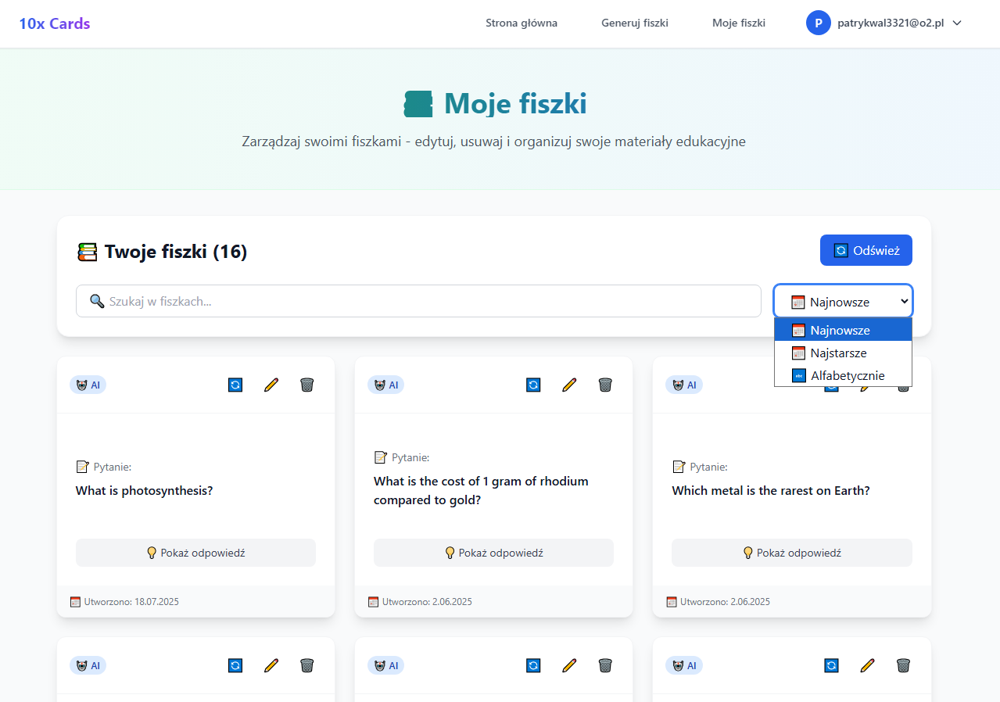

## 📚 📋 O projekcie 10x Cards

10x Cards to innowacyjna aplikacja, która rozwiązuje czasochłonny proces ręcznego tworzenia fiszek edukacyjnych poprzez dostarczenie rozwiązania opartego na AI. Aplikacja łączy efektywność automatycznego generowania treści z sprawdzoną metodologią nauki przez powtarzanie rozłożone w czasie.

## 🎯 Główne funkcjonalności

🤖 **Generowanie fiszek przez AI** - wykorzystuje zaawansowane modele LLM (OpenRouter API) do automatycznego tworzenia fiszek z tekstu  
✏️ **Ręczne tworzenie fiszek** - możliwość tworzenia niestandardowych fiszek z własną treścią  
📚 **Zarządzanie fiszkami** - edycja, usuwanie i organizowanie kolekcji fiszek  
🔁 **Powtarzanie rozłożone w czasie** - wbudowany algorytm do optymalnych sesji nauki  
👤 **System autentykacji** - bezpieczny system kont z ochroną prywatności danych  
📊 **Analityka nauki** - śledzenie statystyk generowania i akceptacji fiszek  
📱 **Responsywny design** - pełna optymalizacja dla urządzeń mobilnych  

## 🖼️ Screenshoty

### Strona główna


*Intuicyjny interfejs z polem do wklejania tekstu i generowania fiszek*

### Moje fiszki

*Zarządzanie kolekcją fiszek z możliwością edycji i usuwania*

## 🚀 Technologie

### Frontend
- **Astro 5** - szybki framework z minimalnym JavaScript
- **React 19** - interaktywne komponenty
- **TypeScript 5** - statyczne typowanie
- **Tailwind CSS 3** - utility-first CSS framework
- **Shadcn/ui** - biblioteka komponentów UI

### Backend & Serwisy
- **Supabase** - kompleksowe rozwiązanie backendowe:
  - PostgreSQL - baza danych
  - Autentykacja użytkowników
  - Row Level Security (RLS)
- **OpenRouter API** - dostęp do modeli AI z kontrolą kosztów

### AI & Integracje
- **OpenRouter API** - dostęp do różnych modeli LLM
- **Meta Llama 3.2** - model do generowania fiszek
- **Inteligentna analiza tekstu** - automatyczne wyodrębnianie kluczowych pojęć

### DevOps & Testy
- **Vitest** - szybkie testy jednostkowe i integracyjne
- **ESLint & Prettier** - jakość i formatowanie kodu
- **Husky** - git hooks dla jakości kodu

## 📁 Struktura projektu

```
10x-astro-starter/
├── .github/
│   └── workflows/           # GitHub Actions workflows
├── public/                  # Zasoby statyczne
├── src/
│   ├── components/         # Komponenty React
│   │   ├── auth/          # Komponenty autentykacji
│   │   ├── flashcards/    # Komponenty zarządzania fiszkami
│   │   ├── generate/      # Komponenty generatora
│   │   ├── hooks/         # Custom hooks
│   │   ├── navigation/    # Komponenty nawigacji
│   │   └── ui/            # Komponenty UI
│   ├── contexts/          # React Contexts
│   ├── db/                # Konfiguracja bazy danych
│   ├── layouts/           # Układy stron
│   ├── lib/               # Integracje i serwisy
│   │   ├── services/      # Serwisy biznesowe
│   │   └── validation/    # Schematy walidacji
│   ├── middleware/        # Middleware Astro
│   ├── pages/             # Strony aplikacji
│   │   └── api/           # API endpoints
│   ├── styles/            # Style globalne
│   └── test/              # Konfiguracja testów
├── supabase/
│   └── migrations/        # Migracje bazy danych
└── [pliki konfiguracyjne]
```

## 🛠️ Instalacja i uruchomienie

### Wymagania
- Node.js 22+
- npm lub yarn
- Konto Supabase
- Klucz API OpenRouter

### Kroki instalacji

1. **Sklonuj repozytorium**
   ```bash
   git clone https://github.com/PatrykWalczak/10x-cards.git
   cd 10x-cards
   ```

2. **Użyj odpowiedniej wersji Node.js**
   ```bash
   nvm use
   ```

3. **Zainstaluj zależności**
   ```bash
   npm install
   ```

4. **Skonfiguruj zmienne środowiskowe**
   ```bash
   cp .env.example .env
   ```
   
   Wypełnij plik `.env`:
   ```bash
   # Supabase Configuration
   PUBLIC_SUPABASE_URL=your_supabase_url
   PUBLIC_SUPABASE_ANON_KEY=your_supabase_anon_key
   SUPABASE_KEY=your_supabase_service_key

   # OpenRouter AI Configuration
   OPENROUTER_API_KEY=your_openrouter_api_key
   ```

5. **Uruchom migracje Supabase**
   ```bash
   npx supabase db push
   ```

6. **Uruchom aplikację**
   ```bash
   npm run dev
   ```

## 🧪 Testowanie

### Testy jednostkowe
```bash
npm run test
```

### Testy w trybie obserwacji
```bash
npm run test:watch
```

### Pokrycie kodu
```bash
npm run test:coverage
```

## 📦 Deployment

Aplikacja może być łatwo wdrożona na różnych platformach:

- **Vercel** - automatyczny deployment z GitHub
- **Netlify** - ciągłe wdrażanie
- **DigitalOcean** - hosting przez Docker
- **Cloudflare Pages** - szybki hosting statyczny

### Ręczny build
```bash
npm run build
```

## 🔒 Bezpieczeństwo

- ✅ Autentykacja oparta na JWT (Supabase Auth)
- ✅ Row Level Security (RLS) w PostgreSQL
- ✅ Walidacja danych po stronie klienta i serwera
- ✅ Bezpieczne przechowywanie kluczy API
- ✅ Ochrona przed XSS i CSRF

## 📈 Przyszłe funkcjonalności

- 🎯 **Zaawansowane algorytmy powtarzania** - personalizowane interwały nauki
- 📊 **Szczegółowa analityka** - raporty postępów i statystyki nauki
- 👥 **Współdzielenie fiszek** - udostępnianie kolekcji innym użytkownikom
- 🔍 **Zaawansowane wyszukiwanie** - filtrowanie fiszek po słowach kluczowych
- 📱 **Aplikacja mobilna** - natywne aplikacje iOS/Android
- 🌍 **Wielojęzyczność** - wsparcie dla wielu języków
- 🎨 **Personalizacja** - motywy i dostosowywanie interfejsu
- 📋 **Import/Export** - przenoszenie fiszek między platformami


## 🤝 Autorzy

Projekt stworzony jako część kursu programowania **10xdevs**.

## 📄 Licencja

Ten projekt jest licencjonowany na podstawie licencji MIT - zobacz plik [LICENSE](LICENSE) dla szczegółów.


<<<<<<< HEAD
=======
**Uwaga**: Ten projekt priorytetowo traktuje prywatność użytkowników i bezpieczeństwo danych. Wszystkie dane osobowe są obsługiwane zgodnie z przepisami RODO, a użytkownicy mają pełną kontrolę nad swoimi danymi z prawem dostępu i usunięcia.
>>>>>>> 65b176cec76852580f03a9147190712881e979b5
